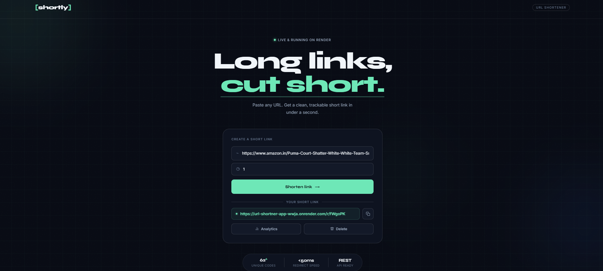

\# 🔗 URL Shortener Application


A simple and responsive URL Shortener application built using Spring Boot and Vanilla JavaScript.  

The application allows users to generate short URLs, redirect links, track clicks, and manage shortened URLs.


\---


\## 🌐 Live Demo


🔗 https://url-shortner-app-wwja.onrender.com/


\---


\## 📸 Preview





\## ✨ Features


\- 🔗 Shorten long URLs

\- 📊 Track total clicks

\- ⏰ Set URL validity duration

\- 📈 View URL statistics

\- 🗑️ Delete shortened URLs

\- ↪️ Redirect to original URLs

\- 📱 Responsive modern UI


\---


\## 🛠️ Tech Stack


| Layer | Technology |

|---|---|

| Backend | Java, Spring Boot |

| Frontend | HTML, CSS, JavaScript |

| Database | H2 Database |

| ORM | Spring Data JPA, Hibernate |

| Build Tool | Maven |

| Deployment | Docker, Render |


\---


\## 📁 Project Structure


```bash

src/

├── main/

│   ├── java/

│   │   └── urlshortner/

│   │       ├── controller/

│   │       ├── service/

│   │       ├── repository/

│   │       ├── entity/

│   │       └── Application.java

│   │

│   └── resources/

│       ├── static/

│       │   ├── index.html

│       │   ├── style.css

│       │   └── app.js

│       │

│       └── application.properties

│

└── test/

```


\---


\## 📡 API Endpoints


| Method | Endpoint | Description |

|---|---|---|

| POST | `/api/shorten` | Create short URL |

| GET | `/r/{shortCode}` | Redirect to original URL |

| GET | `/api/stats/{shortCode}` | Get URL statistics |

| DELETE | `/api/delete/{shortCode}` | Delete short URL |


\---


\## ⚙️ Run Locally


\### Clone Repository


```bash

git clone https://github.com/dynamicshreyashh/url\_shortner\_app.git

```


\### Navigate to Project


```bash

cd url\_shortner\_app

```


\### Build Project


```bash

mvn clean package

```


\### Run Application


```bash

java -jar target/urlshortner-0.0.1-SNAPSHOT.jar

```


\---


\## 🐳 Docker Setup


\### Build Docker Image


```bash

docker build -t url-shortener .

```


\### Run Docker Container


```bash

docker run -p 8080:8080 url-shortener

```


\---


\## 👨‍💻 Author


Shreyash Bhosale


GitHub:  

https://github.com/dynamicshreyashh

